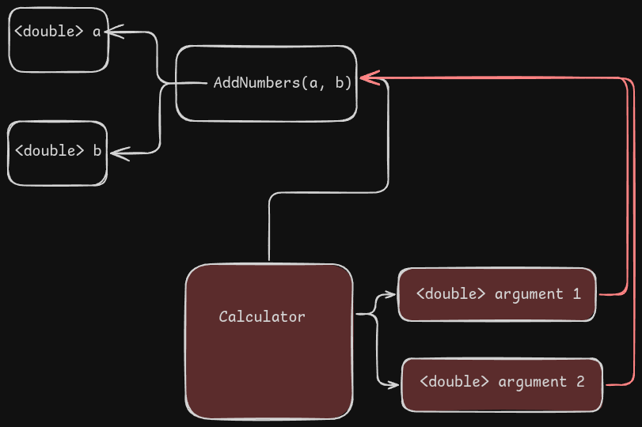

# C# Lesson in OOP, Methods, datatypes and casting


# Dependencies
```sh
dotnet add package Spectre.Console
```

# Demos

## Fibonacci sequence using signed & unsiged integers to demonstrate overflow
```sh
// psuedo code
void calcSigned() -> {
    a = 0
    b = 1
    index = 1

    try {
        check-for-overflow // activate an overflow check
        while(true) {
            next = a + b
            index++ // increment the index
            print index = next
            a = b
            b = next
        }
    } catch(exception) {
        exit(1)
    }
}
```

### implementation
```c
/*
    This program is free software: you can redistribute it and/or modify
    it under the terms of the GNU General Public License as published by
    the Free Software Foundation, either version 3 of the License, or
    (at your option) any later version.

    This program is distributed in the hope that it will be useful,
    but WITHOUT ANY WARRANTY; without even the implied warranty of
    MERCHANTABILITY or FITNESS FOR A PARTICULAR PURPOSE.  See the
    GNU General Public License for more details.

    You should have received a copy of the GNU General Public License
    along with this program.  If not, see <https://www.gnu.org/licenses/>.
*/
```